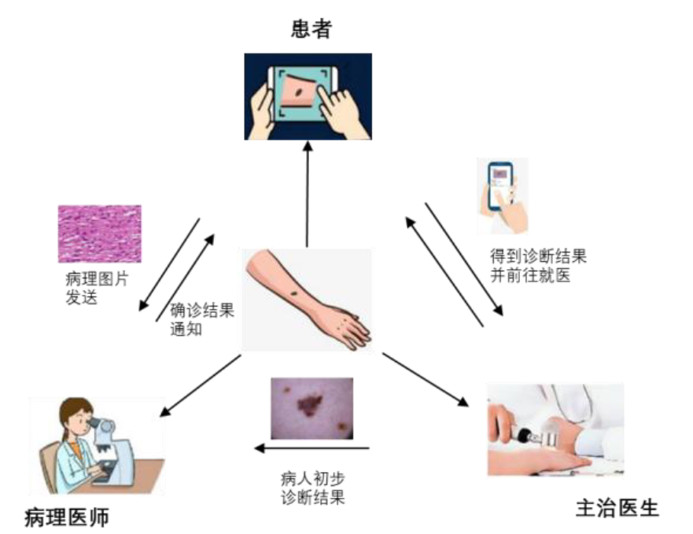

# 基于 EasyDL 的皮肤癌多用户辅助诊断系统
皮肤癌多用户诊断系统目标用户包含患者、主治医生和病理医师三种角色。患者模块为小程序端应用，主体功能包括拍照诊断、AI 智能问诊与医患交互；主治医生模块分为硬件与网页端应用，医生通过皮肤显微镜拍摄病人皮肤，画面显示在树莓派开发板显示屏上，点击显示屏触控按钮，摄像头在画面录制期间进行图片抓拍，将图片交给模型诊断，预测结果呈现在显示屏上，具体结果分析可在网页端查看，并且根据患者病情决定是否交给病理医师进一步问诊；病理医师接收主治医生传来的患者的诊断信息，可在网页上传患者的病理采集图片，生成诊断结果，结合主治医生的问诊建议进行确诊。
## 使用Vue3技术开发web前端页面
### 应用模块图

  <figure>
    
  </figure>

### 训练数据标记

  <figure>
    
  </figure>

### 小程序界面

  <figure>
    
  </figure>

### 网页界面1

  <figure>
    
  </figure>

### 网页界面2

  <figure>
    
  </figure>

### 总体框架图

  <figure>
    
  </figure>

